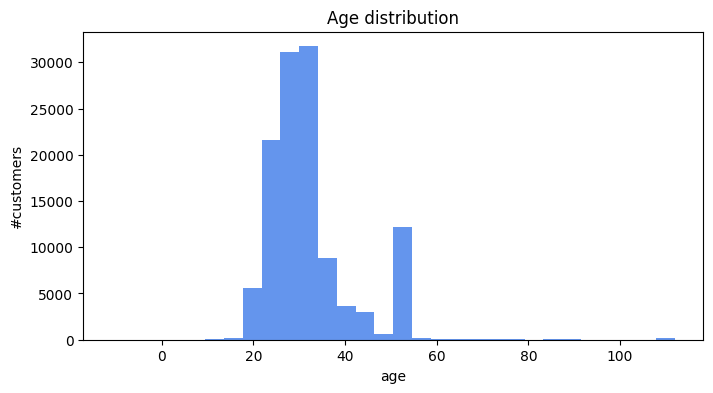

# **Customer Behavior Analysis and Recommendations**
## **1. Define the Problem**
### **Situation**
The Product Team is tasked with evaluating customer behavior when using the product to identify opportunities for improvement and to introduce new features.

### **Complication**
We have gathered data from four years of online booking history, which will be the basis for our analysis.

### **Questions**
1. What unique behaviors do our customers exhibit?
2. What actions should we take to increase sales and improve product quality?

## **2. Customer Behavior Analysis**
### **Demographic**
- **Age Distribution**: 75% of customers are aged 26-35, indicating they have been in the workforce for a few years with stable incomes.
- **Family Status**: The 36-50 age group is primarily composed of individuals with families.

- **Data Verification**: 11% of customers have not verified their information, and this issue needs to be resolved.

### **Trend**
- **Seasonality**: Two peak seasons have been identified: May-July and October-December, which correspond with summer and year-end holidays.
  - **Action**: Focus marketing efforts during these periods to boost sales.

- **Weekday vs. Weekend Sales**: Sales during the weekend are 1.5 times higher than on weekdays (Monday to Thursday).
  - **Action**: Develop programs to increase weekday sales.

### **Payment Behavior**
- **App Usage**: 89% of customers use the app to book tickets, with 55% using iOS devices.
  - **Action**: Continuously improve the app's user experience.
- **Device Identification**: 45% of orders do not have device information recorded.
  - **Action**: Investigate and resolve this issue.

- **Payment Method**: Around 80% of customers, across all age groups, prefer using the app or bank accounts for payments.
  - **Action**: Enhance the payment experience for these methods.

- **Debit/Credit Card Ownership**: Debit or credit card ownership among the 19-25 age group is low.
  - **Action**: Collaborate with universities to provide debit cards to students.
- **Promotion-Driven Purchases**: A large percentage of customers only engage once, primarily driven by promotions.
  - **Action**: Develop strategies to convert these one-time users into repeat customers.
### **Customer Value**
- **Promotion Preferences**: 90% of customers prefer direct discount programs.

- **Focus on New vs. Returning Customers**: The current strategy overly focuses on acquiring new customers (97% of promotions are for new customers), with minimal efforts to retain existing customers.
- **Retention Rate**: Retention after one month is very low, averaging only 3%, with no significant difference between organic and promotion-driven customers.
  - **Action**: Introduce a loyalty program to increase retention rates.

### **Customer Success Rate**
- **Payment Success**: The payment success rate is relatively high, ranging from 85-90%.

- **Error Management**: Approximately 10% of customers experience errors due to external factors, such as issues with banks or third-party services.
  - **Action**: The system needs to handle these issues promptly when they arise.

## **3. Recommendations**
### **New Customers**
- **Marketing Strategy**: Focus on direct discount campaigns to attract new customers (63% of new customers used promotions).
- **Peak Season Campaigns**: Increase campaign intensity during peak seasons (e.g., blockbuster movie releases) to maximize sales.
- **Weekday Sales Optimization**: Implement special promotions for existing customers who book tickets from Monday to Thursday.
### **Old Customers**
- **Retention Strategy**:
  - Replace the current point system with a program that offers discount coupons for the next booking.
  - Introduce combo deals that include tickets and food/beverages.
  - Develop cross-selling programs, such as discounts for booking multiple movies or purchasing multiple tickets.
### **Platform Improvement**
- **UI/UX Enhancements**: Given that ~89% of customers use the app, focus on improving the app's user interface and experience.

- **Payment Flow Optimization**: Enhance the payment process, particularly for customers using bank accounts or in-app payments (~80% of customers).

- **Device Recognition Issue**: Resolve the issue of unrecognized devices in 2022, affecting 45% of orders.
  - **Action**: Encourage customers to use app-based or bank account payments to reduce errors and improve overall experience.

### **Product Quality Improvement**
- **Error Handling**: Collaborate with third parties (e.g., banks) to promptly address system errors and perform timely maintenance.
- **Feedback & Rating Analysis**: Regularly analyze customer feedback and ratings to identify areas for improvement.
### **Customer Journey (Funnel)**
Continue to map out the customer journey, identifying key touchpoints for improvement, and take actions accordingly.
